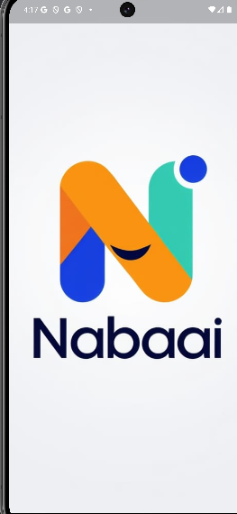

# 📰 Nabaa - AI-Powered Journalism Platform

**Nabaa** is an intelligent journalism platform developed as a graduation project in **Information Technology**.

The platform combines **Artificial Intelligence (AI), Natural Language Processing (NLP), Retrieval-Augmented Generation (RAG), Machine Learning, and modern mobile development technologies** to provide a smarter and more interactive news consumption experience.

🏆 **Graduation Project Grade: 99/100**

---

## ✨ Key Features

### 📰 Smart News Aggregation

* Fetches news from multiple sources using **News APIs**.
* Organizes news into different categories.
* Provides a clean and user-friendly mobile interface.

### 🤖 AI News Summarization

* Generates concise summaries of news articles.
* Uses the **Gemini API** for AI-powered summarization.
* Helps users understand long articles quickly.

### 🏷️ Arabic News Classification

* Automatically classifies Arabic news articles.
* Uses the **MARBERT NLP model**.
* Supports multiple news categories.

### 💬 Comment Analysis

* Analyzes user comments using Machine Learning.
* Uses **TF-IDF** for text feature extraction.
* Uses **LinearSVC** for classification.

### 🔍 Retrieval-Augmented Generation (RAG)

* Retrieves relevant information related to news content.
* Uses retrieved information to generate contextual responses.
* Improves the relevance and accuracy of AI-generated responses.

### 🔊 Text-to-Speech

* Converts news articles from text into audio.
* Provides an alternative way for users to consume news.
* Improves accessibility and user experience.

### 🔐 Authentication & User Management

* User registration and login.
* Profile management.
* Secure authentication using **Supabase**.

---

## 🛠️ Technology Stack

### Mobile Development

* **Flutter**
* **Dart**
* **GetX**
* **MVC Architecture**
* **GetStorage**

### Backend & Database

* **Supabase**
* **PostgreSQL**

### Artificial Intelligence & NLP

* **Gemini API**
* **MARBERT**
* **RAG**
* **Hugging Face API**
* **Natural Language Processing (NLP)**

### Machine Learning

* **Scikit-learn**
* **TF-IDF**
* **LinearSVC**

### Data Science & Development

* **Python**
* **Pandas**
* **Jupyter Notebook**
* **Anaconda**
* **Flask**

### Other Technologies

* **News APIs**
* **Text-to-Speech (TTS)**

---

## 🏗️ System Overview

The platform follows a pipeline that combines traditional software development with AI technologies:

```text
                News Sources
                     │
                     ▼
                 News APIs
                     │
                     ▼
              ┌─────────────┐
              │    Nabaa    │
              │ Mobile App  │
              └─────────────┘
                     │
        ┌────────────┼────────────┐
        ▼            ▼            ▼
   Classification  Summarization  RAG
     MARBERT       Gemini API     Pipeline
        │            │            │
        └────────────┼────────────┘
                     ▼
              News Presentation
                     │
             ┌───────┴────────┐
             ▼                ▼
       User Interaction    Text-to-Speech
```

---

## 🗄️ Database

The backend is powered by **Supabase**, with **PostgreSQL** as the underlying database.

The project includes data entities such as:

* Users
* User Types
* Account Status
* News
* Articles
* Comments
* Images
* Sources
* Categories

---

## 🤖 AI Components

Nabaa integrates several AI technologies, each serving a specific purpose:

| Technology             | Purpose                                            |
| ---------------------- | -------------------------------------------------- |
| **Gemini API**         | News summarization                                 |
| **MARBERT**            | Arabic news classification                         |
| **RAG**                | Context-aware information retrieval and generation |
| **TF-IDF + LinearSVC** | Comment analysis                                   |
| **Text-to-Speech**     | Converting news text into audio                    |

This combination allows Nabaa to go beyond traditional news aggregation and provide an **AI-enhanced journalism experience**.

---

## 🚀 Getting Started

### Prerequisites

Before running the project, make sure you have:

* Flutter SDK
* Dart SDK
* Android Studio
* Git
* A Supabase project
* Required API keys

### Installation

Clone the repository:

```bash
git clone https://github.com/YOUR_USERNAME/nabaa.git
```

Navigate to the project directory:

```bash
cd nabaa
```

Install Flutter dependencies:

```bash
flutter pub get
```

Configure the required environment variables and API credentials.

Then run the application:

```bash
flutter run
```

---

## 🔑 Environment Variables

For security reasons, **API keys and secrets should not be committed to this repository**.

Configure the required credentials for services such as:

* Supabase
* Gemini API
* News APIs
* Hugging Face API

> Never expose private API keys, passwords, service-role keys, or other sensitive credentials in the source code.

---

## 📱 Screenshots


<!-- Add screenshots here -->
 
---

## 🎓 Graduation Project

**Nabaa** was developed as a graduation project for the **Information Technology** program.

### Project Grade

🏆 **99/100**

The project demonstrates the integration of:

* Mobile Application Development
* Artificial Intelligence
* Natural Language Processing
* Machine Learning
* Generative AI
* Retrieval-Augmented Generation
* Speech Technology
* Backend Development
* Database Management

---

## 🔮 Future Improvements

Potential future improvements include:

* Personalized news recommendations.
* More advanced multilingual support.
* Improved AI-powered fact checking.
* More advanced sentiment and toxicity analysis.
* Real-time news notifications.
* Improved RAG capabilities.
* Additional news sources.
* Web and desktop versions.

---

## 👨‍💻 Author

Developed as an Information Technology graduation project.

**Nabaa — AI-Powered Journalism Platform**

---

## 📄 License

This project was developed as an academic graduation project.
